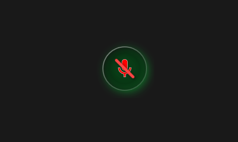
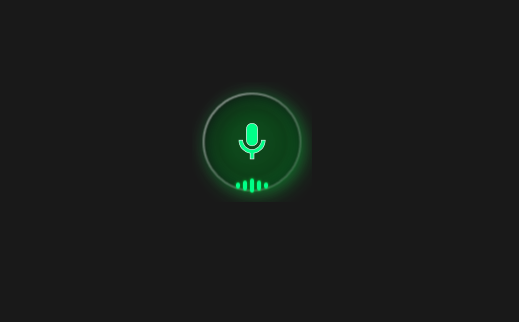
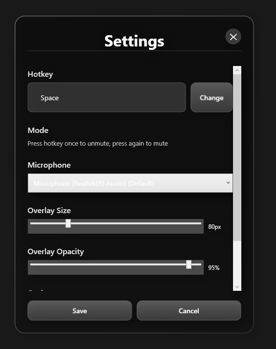

# Mic Push-To-Talk

A modern Windows desktop application for system-wide push-to-talk microphone control with a beautiful glassmorphism overlay.


## 📸 Screenshots

<div align="center">

### Overlay States

| Muted (Default) | Active (Talking) |
|:---------------:|:----------------:|
|  |  |
| 🔴 Red icon with cross | 🟢 Green glowing icon with pulse |

### Settings Window



*Modern glassmorphism UI with customizable options*

</div>

---

## ✨ Features

- **System-Wide Push-To-Talk**: Control your microphone from any application
- **Global Hotkey Support**: Keyboard keys, mouse buttons, and modifier combinations
- **Glassmorphism UI**: Modern, transparent overlay with smooth animations
- **Always-On-Top**: Stays visible above all applications including fullscreen games
- **Draggable Overlay**: Position anywhere on screen with edge snapping
- **Animated Mic Icon**: Visual feedback with glow effects and smooth transitions
- **Volume Visualizer**: Real-time microphone level display
- **System Tray Integration**: Minimize to tray with quick access menu
- **Customizable Settings**: Adjust size, opacity, colors, and behavior
- **Multiple Microphone Support**: Select from available audio devices
- **Low Latency**: Fast response using Windows Core Audio APIs

## 🚀 Quick Start

### For Users (No Installation Required!)

1. **Download** the latest release from [Releases](https://github.com/jamilahmed2/mic-push-to-talk/releases)
2. **Extract** the ZIP file to any folder
3. **Run** `MicPushToTalk.exe`
4. **Done!** No .NET installation needed

See [QUICK-START.md](QUICK-START.md) for detailed instructions.

### For Developers

```bash
# Clone repository
git clone https://github.com/jamilahmed2/mic-push-to-talk.git
cd mic-push-to-talk

# Build self-contained executable
publish.bat

# Output: .\publish\MicPushToTalk\MicPushToTalk.exe
```

See [DEPLOYMENT.md](DEPLOYMENT.md) for build options and distribution guide.

## 📦 Download

**Latest Release:** [v1.0.0](https://github.com/jamilahmed2/mic-push-to-talk/releases/latest)

- **Portable Version** (Recommended): `MicPushToTalk-v1.0.0-win-x64.zip` (~50 MB compressed, ~174 MB extracted)
- No installation required
- No .NET runtime needed
- Works on any Windows 10/11 x64 system

## Tech Stack

- C# .NET 8
- WPF (Windows Presentation Foundation)
- MVVM Architecture
- NAudio for audio control
- Win32 APIs for global hotkeys

## 📋 System Requirements

- **OS**: Windows 10 (1809+) or Windows 11
- **Architecture**: 64-bit (x64)
- **RAM**: 50 MB minimum
- **Disk Space**: 100 MB
- **Permissions**: Microphone access
- **.NET Runtime**: Not required (self-contained)

## Requirements

- Windows 10/11
- .NET 8 Runtime

## Installation

1. Clone the repository
2. Open `MicPushToTalk.sln` in Visual Studio 2022
3. Restore NuGet packages
4. Build and run

## Usage

### First Launch

1. The overlay will appear as a floating circular button
2. By default, press **Left Alt** to toggle your microphone
3. Press again to mute
4. Right-click the tray icon to access settings

### How It Works

- **Press hotkey once** → Microphone unmutes (green icon)
- **Press hotkey again** → Microphone mutes (red icon)
- **Click overlay** → Manually toggle mute state
- Simple on/off toggle like a light switch

### Customization

Open Settings to configure:

- **Hotkey**: Change the toggle key
- **Microphone**: Select which microphone to control
- **Overlay Size**: Adjust the button size (60-150px)
- **Overlay Opacity**: Change transparency (30-100%)
- **Snap to Edges**: Auto-snap when dragging near screen edges
- **Volume Visualizer**: Show/hide real-time audio levels
- **Start on Boot**: Launch automatically with Windows

### Hotkey Examples

- Single keys: `Left Alt`, `Caps Lock`, `F13`
- Mouse buttons: `Mouse Button 4`, `Mouse Button 5`
- Combinations: `Ctrl + Space`, `Alt + Shift + M`

## Visual States

### Muted (Default)
- Red microphone icon with cross
- Dark glass background
- Subtle shadow

### Active (Talking)
- Green/cyan glowing microphone
- Pulsing ring animation
- Scale bounce effect
- Volume visualizer bars

## Architecture

```
MicPushToTalk/
├── Models/
│   ├── AppSettings.cs          # Settings data model
│   └── MicrophoneDevice.cs     # Microphone info
├── ViewModels/
│   ├── OverlayViewModel.cs     # Overlay logic
│   └── SettingsViewModel.cs    # Settings logic
├── Views/
│   ├── OverlayWindow.xaml      # Main overlay UI
│   └── SettingsWindow.xaml     # Settings UI
├── Services/
│   ├── AudioService.cs         # Microphone control
│   ├── HotkeyService.cs        # Global hotkey handling
│   ├── SettingsService.cs      # Settings persistence
│   └── TrayService.cs          # System tray integration
├── Helpers/
│   └── Win32Helper.cs          # Win32 API wrappers
└── Styles/
    └── GlassmorphismStyles.xaml # UI styling
```

## Key Components

### AudioService
- Uses NAudio CoreAudioApi
- Controls Windows default microphone
- Provides mute/unmute functionality
- Monitors volume levels
- Enumerates available devices

### HotkeyService
- Registers global hotkeys using Win32 API
- Low-level keyboard hook for better detection
- Supports keyboard and mouse buttons
- Handles modifier combinations

### OverlayWindow
- Always-on-top transparent window
- Hardware-accelerated rendering
- Smooth WPF animations
- Draggable with edge snapping
- Click-through mode support

### SettingsService
- JSON-based settings persistence
- Stored in AppData folder
- Auto-saves position and preferences

## Performance

- **CPU Usage**: <1% idle, ~2% active
- **RAM Usage**: ~30-50 MB
- **Latency**: <10ms response time
- **GPU**: Hardware accelerated (WPF)

## Troubleshooting

### Overlay not visible
- Check if overlay is hidden (toggle from tray menu)
- Ensure window is not off-screen
- Try resetting position in settings

### Hotkey not working
- Check if another app is using the same hotkey
- Try a different key combination
- Run as administrator if needed

### Microphone not muting
- Verify correct microphone is selected in settings
- Check Windows audio permissions
- Ensure microphone is not disabled in Windows

### Fullscreen games
- Some games may block overlays
- Try borderless windowed mode
- Enable "OBS-safe mode" in settings (if implemented)

## Building from Source

```bash
# Clone repository
git clone https://github.com/jamilahmed2/mic-push-to-talk.git
cd mic-push-to-talk

# Restore packages
dotnet restore

# Build
dotnet build --configuration Release

# Run
dotnet run --project MicPushToTalk
```

## Future Enhancements

- [ ] OBS-safe mode for streaming
- [ ] Sound effects on toggle
- [ ] Multiple hotkey profiles
- [ ] Push-to-mute mode
- [ ] Auto-hide when inactive
- [ ] Custom themes and colors
- [ ] Keyboard shortcuts for settings
- [ ] Multi-monitor improvements

## License

MIT License - See LICENSE file for details

## Credits

- Built with [NAudio](https://github.com/naudio/NAudio)
- Uses [CommunityToolkit.Mvvm](https://github.com/CommunityToolkit/dotnet)
- Inspired by Discord overlay and Stream Deck

## Support

For issues, questions, or feature requests, please open an issue on GitHub.
